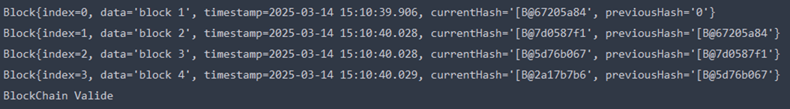

# Blockchain Example

This project demonstrates the basic concept of a blockchain implementation in Java. It uses classes `Block` and `App` to simulate a chain of blocks, where each block stores data, a timestamp, a hash, and a reference to the previous block’s hash. It verifies the integrity of the chain by ensuring that each block’s previous hash matches the current hash of the previous block.

## Project Structure

- **pom.xml**: Maven project configuration file.
- **App.java**: The main application that initializes the blockchain and verifies it.
- **Block.java**: Contains the structure and logic for a single block in the blockchain.

## Dependencies

This project uses the following dependency:
Commons Codec for SHA-256 hashing.

Maven will handle downloading these dependencies automatically when building the project.

## How to Run

1. **Clone the repository**:

   ```bash
   git clone https://github.com/mrbenboyy/blockchain-java.git
   cd blockchain-java
   ```

2. **Build the project** using Maven:

   ```bash
   mvn clean install
   ```

3. **Run the application**:

   ```bash
   mvn exec:java -Dexec.mainClass="ma.mundiapolis.App"
   ```

4. **Expected Output**:

   After running the program, the blockchain's blocks will be printed to the console, and the program will verify if the blockchain is valid.

   

## Screenshot of Output

Here’s an example screenshot of the output in the terminal when you run the application:



## Conclusion

This project is a simple introduction to blockchain concepts. It demonstrates how data integrity can be ensured through hashing and the linking of blocks using cryptographic techniques.

## License

This project is licensed under the MIT License.